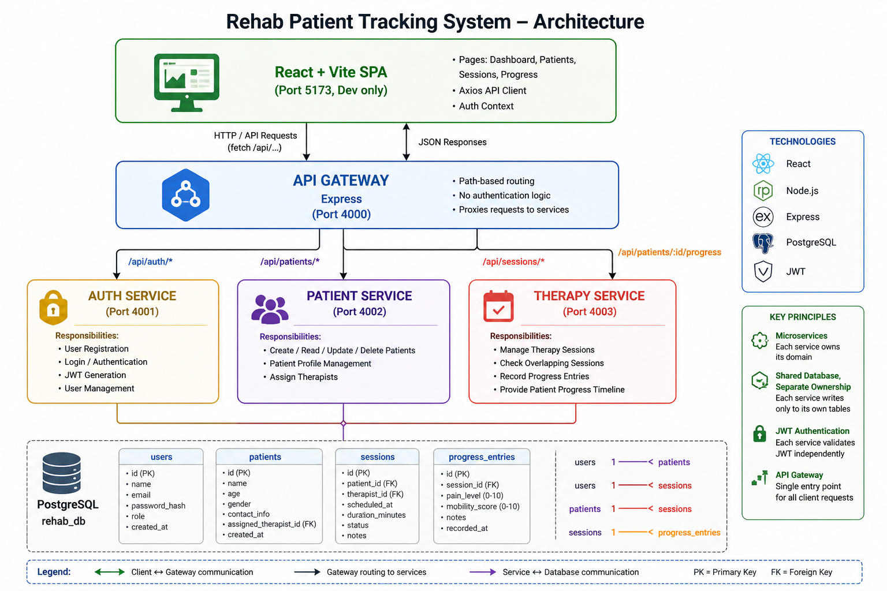
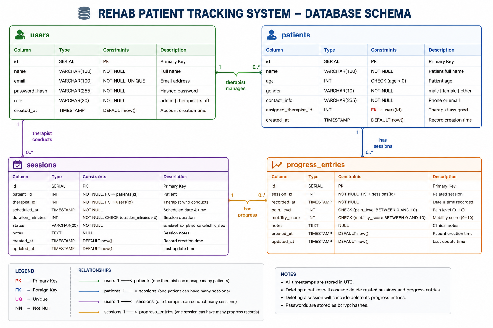

# Rehab Patient Tracking System

A full-stack web application for rehabilitation clinics to track patients, schedule therapy sessions, and monitor recovery progress over time. Built as the SE ZG503 — Full Stack Application Development assignment, BITS Pilani.

---

## 🔗 Quick Links (For Evaluation)

- 🎥 Demo Video  
https://drive.google.com/file/d/1bpKIjCcxH3qgyhtKpTIqjRKsGdJ94bzZ/view  

- 📄 Documentation (Google Drive Folder)  
https://drive.google.com/drive/folders/1Fffz6WDX5pxKFrYFLCVQZ1OrlRJB0Lxo  

- 💻 GitHub Repository  
https://github.com/2025tm93238/rehab-system  

---

## 📊 Key System Diagrams

### Architecture


### Database Schema


### Component Hierarchy


---

## Problem

Rehabilitation clinics often struggle to track patient therapy sessions, monitor recovery progress, and maintain structured records. Manual tracking leads to inconsistent documentation and poor visibility into patient outcomes. This system provides a centralized platform to manage patient registration, therapy sessions, and progress tracking with role-based access for therapists and administrators.

---

## What's in the box

- 3 backend microservices + 1 API gateway (Node.js + Express, JWT auth)
- PostgreSQL for persistence — one shared DB, four tables
- React + Vite SPA with routing and protected routes
- Features: scheduling, progress tracking, dashboard, charts

---

## Architecture (one-liner)

```
React (5173) → API Gateway (4000)
                → Auth Service (4001)
                → Patient Service (4002)
                → Therapy Service (4003)
                → PostgreSQL
```

---

## Repository layout

```
rehab-system/
├── api-gateway/
├── auth-service/
├── patient-service/
├── therapy-service/
├── frontend/
└── docs/
```

---

## Tech stack

- Frontend: React, Vite, Axios  
- Backend: Node.js, Express  
- Database: PostgreSQL  
- Auth: JWT, bcryptjs  
- Gateway: http-proxy-middleware  

---

## Getting started

### Prerequisites

- Node.js ≥ 20  
- PostgreSQL ≥ 14  

---

### Install

```bash
git clone https://github.com/2025tm93238/rehab-system
cd rehab-system

( cd auth-service     && npm install )
( cd patient-service  && npm install )
( cd therapy-service  && npm install )
( cd api-gateway      && npm install )
( cd frontend         && npm install )
```

---

### Run

```bash
# Auth
cd auth-service && npm start

# Patient
cd patient-service && npm start

# Therapy
cd therapy-service && npm start

# Gateway
cd api-gateway && npm start

# Frontend
cd frontend && npm run dev
```

Open: http://localhost:5173

---

## Documentation

- docs/API.md  
- docs/ARCHITECTURE.md  
- docs/DB_SCHEMA.md  
- docs/ASSUMPTIONS.md  
- docs/AI_USAGE.md  

---

## Assignment Deliverables

| Deliverable | Location |
|------------|---------|
| Source Code | GitHub repo |
| API Docs | docs/API.md |
| DB Schema | docs/DB_SCHEMA.md |
| Architecture | docs/ARCHITECTURE.md |
| AI Usage | docs/AI_USAGE.md |
| Demo Video | Google Drive link above |
| Documentation | Google Drive folder |

---

## Course

BITS Pilani — SE ZG503  
Full Stack Application Development  
II SEM 2025–2026